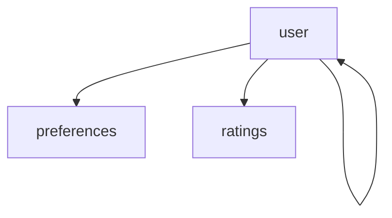

# Import Visualiser

If you are using the [Import Linter](https://import-linter.readthedocs.io/en/stable/) to define
contracts in your Python projects, this tool aims to help visualise that the dependency graph.

## Dependencies

- [Go](https://go.dev/doc/install) (1.24+)

## Usage

To see what flags you can pass to the tool, run:

```shell
go run main.go --help
```

Or you can build it as a binary:

```shell
go build ./...
```

Then run it with the path to your `import-linter` contract file:

```shell
./import-visualiser --help
```

It will generate a `diagram.md` file that contains a Mermaid diagram of the imports defined in your contract.

## Example

If you have a contract file like this:

```toml
[tool.importlinter]
root_packages = ["web"]

[[tool.importlinter.contracts]]
name = "User"
type = "forbidden"
as_packages = false
source_modules = ["web.user.**"]
forbidden_modules = ["web.*"]
ignore_imports = [
    "web.user.** -> web.user",
    "web.user.** -> web.preferences.**",
    "web.user.** -> web.ratings.**",
]
```

We can then run the tool:

```shell
./import-visualiser --config pyproject.toml --part 1
```

This will generate a `diagram.md` file that contains a Mermaid diagram
representing the imports defined in the contract.


